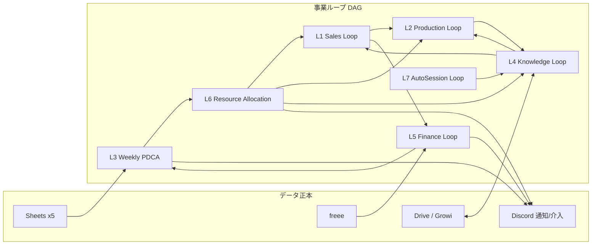
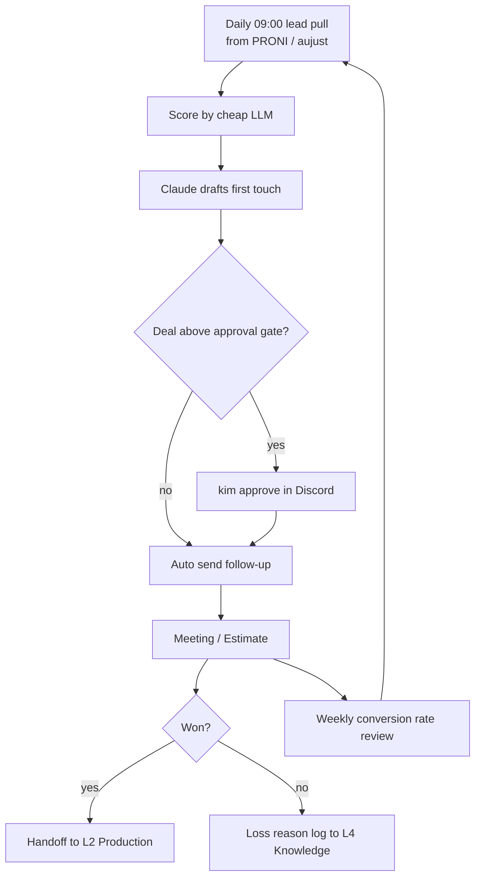
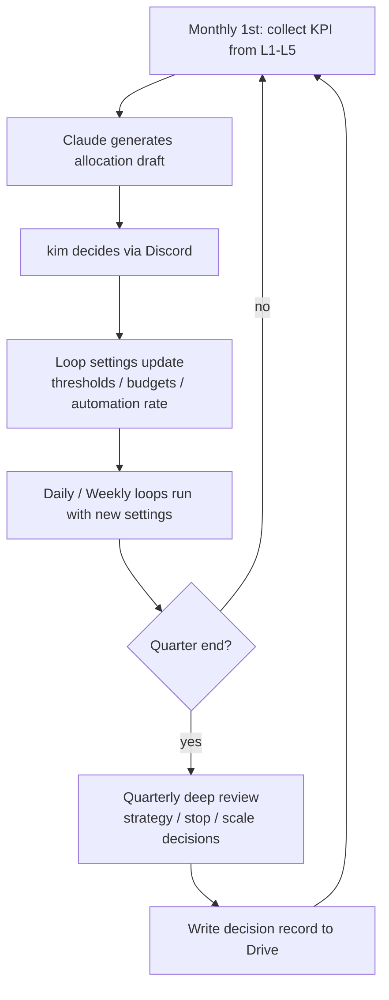

# オージャスト 100億円到達 ループ&グラフ設計書

## 1. エグゼクティブサマリー

現在地は「事業は複数あるが、各々が人手駆動の個別最適で回っている」状態。100億円とのギャップの本質は営業力・納品能力・経営判断速度の人頭依存である。本書は個々の指示（プロンプト）を増やすのではなく、**実行→評価→修正を自律回転するループ**を事業単位で定義し、それを**DAG（グラフ）として接続**する。人（kim）の位置をループの内側の作業者から**外側の監督者（Human on the Loop）**へ移す。既存資産（weekly-bot / daily-top3 / auto-session / Codex委譲 / keyserve）はループの部品として再配置し、新規構想は「新設」と明記する。5年で各ループの自動化率を引き上げ、kimの関与を「方針決定と停止権限」に絞り込むことが、売上10倍を人員10倍なしで成立させる設計の核である。

## 2. 売上100億の構造分解（想定）

| 事業 | 現在の位置づけ | 5年後イメージ（想定） | 成長エンジン | ボトルネック |
|---|---|---|---|---|
| 学会協賛ナビ | 最優先戦略 | 25〜40億 | 学会数×協賛枠の乗算モデル。一度作った枠が資産化 | 交渉・掲載運用の人手 |
| 展示ブース制作（Reブース） | 既存基幹 | 25〜35億 | リード数×受注率×単価 | 施工キャパ・営業人員 |
| 営業代行・リード獲得（aujust/PRONI） | 稼働中 | 15〜25億 | 契約社数×単価のストック型 | 品質管理・契約獲得速度 |
| イベント運営 | 既存 | 8〜15億 | 案件単発型 | 人的キャパ |
| 秘書AI支援・購買部・カフェ | 補完 | 3〜8億 | 横展開 | 再現性 |

※すべて「想定」。確定数字ではない。合計の全体像として「約80億＋余裕」を狙う配分。共通ボトルネックは**リード→受注の変換率**と**納品の再現性**であり、ここにループを集中させる。

## 3. ループ設計（コア）

原則: 各ループは「入力→処理→出力→検証→次段」で閉じる。kimは結果の監視と停止のみ。数値は周期・自動化率の設計値。

### L1. リード獲得→受注ループ（営業）
- 目的: リードを継続的に生み、受注まで変換率を改善し続ける。
- 入力: PRONI（アイミツ）経由の問い合わせ / aujustリード / ウェブ接触 → 処理: スコアリング→優先順位付け→初動アプローチ（AI下書き）→出力: 商談/見積 → 検証: 受注率・初動リードタイム → 次段: L2（制作）またはL5（資金）
- 周期: 日次。自動化率 現状30%（リード通知のみ）→ 目標80%（初動・フォローまで自動、商談のみ人）
- 介入点: kimは週次で受注率を見る。**見積金額が閾値（例: 単価100万超・総額500万超）を跨ぐ商談だけ承認**。AIが異常な値引き・誤送信候補を検知したら自動停止しDiscordへ。

### L2. ブース制作 受注→納品ループ
- 目的: 受注から施工・納品までを標準工程で回し、再現性と粗利を担保。
- 入力: 受注情報・図面 → 処理: 見積精緻化→工程表生成→原価見積→施工手配→出力: 納品・検収 → 検証: 粗利率・遅延日数・クレーム件数 → 次段: L4（ナレッジ化）
- 周期: 案件駆動＋週次点検。自動化率 現状20% → 目標60%（見積・工程表・発注書ドラフトは自動、施工判断は人/現場）
- 介入点: 粗利が基準割落到達で自動アラート。kimは割れ案件の落とし判定と大口手配のみ。

### L3. 週次経営PDCAループ（weekly-bot進化形）
- 目的: 4社の数字から優先順位を生成し、翌週の行動に落として検証する。
- 入力: Sheets×5＋freee仕訳CSV（既存）＋各ループのKPI → 処理: Claude OpusがTOP5と「先週の指標に対する実績評価」を生成 → 出力: Discord mention（既存）→ 検証: 前週TOPが実行されたか（完了率）→ 次段: 月次はL6へ
- 周期: 週次（月曜09:00、既存）。自動化率 現状70% → 目標90%（実行完了率の自動トラッキングを追加＝新設）
- 介入点: kimはDiscordを読むだけ。ループ自体の停止・方針変更は月次レビューで。

### L4. 知識・人材成長ループ
- 目的: 案件・運用で得た知見を社内マニュアル（Growi/Drive）に蓄積し、次の見積・営業の精度を上げる。
- 入力: L1/L2の完了記録・失敗記録 → 処理: auto-session＋Claudeが差分を抽出 → 出力: マニュアル更新PR → 検証: マニュアル鮮度チェック・参照回数 → 次段: L1/L2の見積基準へ還元
- 周期: 週次。自動化率 現状30%（growi-fetch等）→ 目標80%
- 介入点: kimは月次で「参照されているか」だけ確認。更新は承認不要（監査ログで追跡可能に）。

### L5. 資金・利益管理ループ
- 目的: 売上の伸びに資金繰りと利益率管理が追従し、経常利益10億を財務面から保証する。
- 入力: freee・銀行データ（keyserve経由）→ 処理: 日次で入出金・粗利・運転資本を計算、daily-top3に反映（既存）→ 出力: 経営サマリー・資金アラート → 検証: 予実差異 → 次段: L3へ
- 周期: 日次。自動化率 現状60% → 目標95%
- 介入点: **支払・振込の実行は全件人の承認を維持**（誤送信リスク最上位のため意図的に自動化しない）。kimは承認と、月次の資金計画判断のみ。

### L6. 戦略リソース配分ループ（月次/四半期・新設）
- 目的: 各ループのKPIを横串で見て、人・金・AI予算を次期へ再配分する。
- 入力: L1〜L5のKPIダッシュボード → 処理: Claudeが配分案を生成（例: 学会ナビの増強枠、事業の縮小判定）→ 出力: 意思決定書（DECISION-TEMPLATE準拠）→ 検証: 前四半期配分の成果評価 → 次段: 全ループの設定変更
- 周期: 月次（軽量）/ 四半期（重い）。自動化率 0%（新設）→ 目標70%（案生成まで）
- 介入点: kimの**唯一の常設判断場**。配分の決定と、ループの停止/閾値変更をここで行う。

### L7. 無人実行ループ（auto-session）
- 目的: 上記で生まれたTODO・実装を夜間に無人消化する。
- 入力: 残TODO・コマンドキュー → 処理: Codex実装・Claudeレビュー・mainマージ・デプロイ → 出力: 完了報告 → 検証: /deploy-verify 2段検証 → 次段: L3に結果還元
- 周期: 日次夜間03:20（既存）。自動化率 現状80% → 目標95%（試行上限・異常自動停止の標準搭載）
- 介入点: kimは翌朝の完了報告のみ。失敗は自動リトライ上限で止まり、Discord通知。

## 4. グラフ設計

ループをDAGとして接続する。データは Sheets/freee/Drive に正本を置き、通知・介入はDiscord、実行はClaude（設計・レビュー・監督）/ Codex（実装）/ 安いLLM（下書き・分類）で分業する。

判断フローの分業: 実装=Codex、設計・レビュー・監督=Claude（Opus級）、下書き・スコアリング・分類=安いLLM、停止権限=kim。すべてのクレデンシャルはkeyserve経由でループに渡す（ループ本体に平文を置かない）。

## 5. 詳細Mermaid図

### 5.1 営業ループ（L1）の周期図

### 5.2 月次/四半期の経営レビューサイクル

## 6. KPIとゲート

| ループ | 健全性KPI | 自動↔停止ゲート（設計原則） |
|---|---|---|
| L1営業 | 受注率・初動リードタイム・リード数 | 誤送信検知/値引き超過で即停止 |
| L2制作 | 粗利率・納期遅延・クレーム数 | 粗利基準割れで発注停止・承認へ |
| L3 PDCA | TOP完了率 | 2週連続完了率50%割れで週次を中断し月次前倒し |
| L4知識 | マニュアル鮮度・参照回数 | 鮮度チェック失敗で自動更新停止（古い正本を壊さない） |
| L5資金 | 予実差異・運転資本日数 | 支払は全件承認固定。差異5%超で月次前倒し |
| L6配分 | 各ループKPIの横串達成率 | 配分案は必ず人決定（自動実行しない） |
| L7無人実行 | 成功率・リトライ回数 | 上限到達で自動停止＋Discord通知 |

原則: ゲートは「金額」「外部送信」「不可逆操作」の3類型で必ず人を挟み、それ以外は自動。停止はループ単位で切り、グラフ全体は止めない。

## 7. ロードマップ（FY26=2025/10〜2026/9 起）

- **第1段 FY26-27「計測と接続」**: 既存bot（weekly-bot/daily-top3/auto-session）をL3/L5/L7として正式定義し、KPI計測を全ループに敷設（新設）。自動化率 L1:30→50%。kimが降りるもの: 数字の取りまとめ。
- **第2段 FY27-28「営業の半自動化」**: L1の初動・フォロー自動化、見積ドラフト自動化（L2連携）。L1:70%。kimが降りるもの: リード個別対応・初回フォロー。
- **第3段 FY28-29「配分の仕組み化」**: L6の月次運用を定着、知識ループL4が見積基準を自動更新。L2:40→60%、L4:80%。kimが降りるもの: 部門横断の調整・マニュアル管理。
- **第4段 FY29-31「監督のみへ」**: 全ループ自動化率80%超。kimの常設関与はL6の月次決定＋ゲート承認のみ。学会ナビ等スケール事業は「枠の資産化」で営業人員に依存しない成長へ移行。

## 8. リスクと失敗モード

| 失敗モード | 症状 | 対策 |
|---|---|---|
| 静かな死 | cronが落ちても誰も気づかず、ループが数週間空回り | 各ループに「完了シグナル」を必須化。欠損を翌日のdaily-top3が検知（沈黙=失敗として通知） |
| 誤送信 | AI生成メールの誤宛先・誤表現で顧客信頼毀損 | 外部送信は金額ゲート同様に分類。初動テンプレ外の文面はサンプル検証後に解禁 |
| データ品質崩壊 | Sheets/freeeの入力が滞り、ループがゴミを食う | 入力の鮮度チェック（growi-fetch方式の踏襲）。鮮度NGならループ停止・「未確認」と明示 |
| ループ肥大化 | KPI改善だけが目的化し売上に寄与しない | L6で四半期ごとに「売上/利益への寄与」を再検証、寄与のないループは縮小・停止 |
| 過度の自動停止 | ゲートが多すぎてkimに作業が返る | ゲート追加は「kimの手作業回数/年」を数えてから。代替の自動監視を先に設計する |

## 付記

- 本書の金額配分はすべて想定。第1段でKPI実測が揃い次第、第2版で数値を確定させる。
- 実装の着手順は「L3の完了率トラッキング（新設）→ L1のスコアリング → L6の月次プロトタイプ」を推奨。既存資産の再配置が主で、新規構築は最小である。
